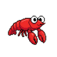

<div align="center">

[🇨🇳 中文](README_zh.md) | **🇺🇸 English** | [🇯🇵 日本語](README_ja.md)

#  Rockpile

**A pixel-art companion living in your MacBook's notch — visualizing AI agent activity in real time**

[](https://www.apple.com/macos/)
[](https://swift.org)
[](LICENSE)
[](https://github.com/ar-gen-tin/rockpile/releases)

[](https://github.com/ar-gen-tin/rockpile/stargazers)
[](https://github.com/ar-gen-tin/rockpile/network/members)
[](https://github.com/ar-gen-tin/rockpile/issues)
[](https://github.com/ar-gen-tin/rockpile/commits/main)

<br>

<!--  -->

</div>

---

## What is Rockpile?

Rockpile is a pixel-art crawfish companion that lives in your MacBook's **Notch area**. It connects to your AI Agent (Claude Code, etc.) via Socket, mapping the agent's thinking, coding, waiting, and error states into real-time sprite animations, emotions, and underwater environment changes.

- 🧠 **Agent thinking** — the crawfish ponders deeply
- 🔨 **Calling tools** — the crawfish works busily
- ⏳ **Waiting for input** — the crawfish looks around
- 💀 **Tokens depleted** — water turns murky, crawfish belly-up...

> A shrimp in the notch.

---

## Features

### 🎮 Dual Creature System

Two pixel creatures share the same tank, each tracking a different AI data source:

| Creature | Role | Data Source |
|----------|------|------------|
| 🦀 **Hermit Crab** | Local AI | Unix Socket / local files |
| 🦞 **Crawfish** | Remote AI | TCP / Gateway WebSocket |

### 🌊 Immersive Underwater Scene

- Pixel-art seabed — sand, swaying seaweed, rising bubbles, light rays
- O₂-linked — the more tokens consumed, the murkier the water and fewer bubbles
- Interaction particles — the two creatures meet and play during idle time, with stars and splashes

### 📊 O₂ Tank (Token Usage Meter)

A Street Fighter-style pixel health bar that intuitively maps token consumption:

| O₂ % | Color | Water Effect |
|-------|-------|-------------|
| 100–60% | 🟢 Green | Clear water, normal bubbles |
| 60–30% | 🟡 Yellow | Darker water, fewer bubbles |
| 30–10% | 🔴 Red blink | Murky water, dim light |
| 0% | 💀 K.O. | Belly-up |

Two modes supported:
- **Claude Quota** — reads `stats-cache.json`, tracks daily subscription quota
- **Pay-as-you-go** — supports Anthropic / xAI / OpenAI API real usage queries

### 🔌 Three Operating Modes

```
Mode A: Local         Mode B: Remote Dual-Mac      Mode C: Server
┌──────────┐     ┌──────────┐  ┌──────────┐    ┌──────────┐
│ Agent    │     │ Agent    │  │ Rockpile │    │ Agent    │
│ Rockpile │     │ Rockpile │  │ 🦞 Notch │    │ Rockpile │
│ 🦞 Notch │     │ (no UI)  │  │ (monitor)│    │ (no UI)  │
└──────────┘     └────┬─────┘  └────┬─────┘    └──────────┘
  Unix Socket         TCP:18790     │              Gateway
                      ────────────▶ │              WebSocket
```

| Mode | Metaphor | Use Case |
|------|----------|----------|
| **Local** | Farm shrimp 🏠 | Agent and App on the same Mac |
| **Monitor** | Fish tank 🐟 | MacBook displays remote Mac Mini's agent status |
| **Server** | Wild shrimp 🌊 | Mac Mini runs Agent, sends events to monitor |

### 🎭 7 States × 4 Emotions

| State | Trigger | Emotion Variants |
|-------|---------|-----------------|
| 💤 Idle | Agent finished task | 😐 😊 😢 😠 |
| 🧠 Thinking | LLM reasoning | 😐 😊 |
| 🔨 Working | Tool calls / code gen | 😐 😊 😢 |
| ⏳ Waiting | Awaiting user input | 😐 😢 |
| ❌ Error | Tool call failed | 😐 😢 |
| 🌀 Compacting | Context compression | 😐 😊 |
| 😴 Sleeping | 5 min inactivity | 😐 😊 |

Emotions are analyzed in real time by Claude Haiku from user message sentiment, with natural 60-second decay.

### 🤝 Interaction System

| Action | Effect |
|--------|--------|
| Click | Context-aware reaction (jump + text) |
| Double-click | Heart particles |
| Long press | Info card |
| Right-click | Feed (+O₂) |

The two creatures automatically interact during idle time — bump, chase circles, claw fist-bump, side-by-side sway.

### 📡 Gateway Bidirectional Communication

- WebSocket connection to remote Agent (`ws://<host>:18789`)
- Real-time remote sessions, token details, health status
- **Reverse commands** — send messages to remote Agent directly from the Notch
- Auto-reconnect (exponential backoff 1s → 30s)
- Token authentication (HMAC-SHA256)

### 🐾 Session Footprints

Sessions are automatically saved after completion, displaying:
- Timestamps (smart format: today `14:32` / yesterday `Yesterday 14:32` / `3/8 14:32`)
- Token consumption (`1.2K` / `2.1M`)
- Tool call summary (`bash·edit·grep +2`)
- Expandable token breakdown (input / output / cache read / cache write)

### 🌏 Three Languages

- 🇨🇳 Chinese
- 🇺🇸 English
- 🇯🇵 Japanese

---

## 📈 Project Statistics

| Metric | Value |
|--------|-------|
| **Language** | Swift 6.0 (100%) |
| **Source Files** | 63 Swift files |
| **Lines of Code** | ~12,600+ |
| **Sprite Assets** | 34 sets (41 images) |
| **Modules** | Core (6) · Models (9) · Services (19) · Views (22) · Window (5) |
| **i18n** | 🇨🇳 Chinese · 🇺🇸 English · 🇯🇵 Japanese |
| **Min Deployment** | macOS 15.0 Sequoia |

---

## Requirements

| Item | Requirement |
|------|------------|
| **OS** | macOS 15.0 (Sequoia) or later |
| **Hardware** | MacBook with Notch (2021+) |
| **Xcode** | 16.0+ (for building from source) |
| **XcodeGen** | `brew install xcodegen` |

---

## Installation

### Option 1: DMG Installer (Recommended)

Download the latest `.dmg` from [Releases](https://github.com/ar-gen-tin/rockpile/releases) and drag to Applications.

> Signed + Apple notarized. Double-click to open, no security workaround needed.

### Option 2: Build from Source

```bash
# Clone the project
git clone https://github.com/ar-gen-tin/rockpile.git
cd rockpile

# Install build tools
brew install xcodegen

# Generate Xcode project & build
xcodegen generate
xcodebuild -project Rockpile.xcodeproj \
  -scheme Rockpile \
  -configuration Release \
  build

# Or open in Xcode directly
open Rockpile.xcodeproj   # Cmd+R to run
```

### Option 3: Signed Release Build

```bash
# Build + sign + DMG
bash build-release.sh

# Build + sign + DMG + Apple notarization
bash build-release.sh notarize
```

Output at `dist/Rockpile-v{version}.dmg`.

---

## Quick Start

### 1. First Launch

Open Rockpile — the setup wizard appears automatically:

1. **Choose language** — Chinese / English / Japanese
2. **Choose mode** — Local / Monitor / Server
3. **Configure O₂** — AI provider, tank capacity, Admin Key (optional)
4. **Install plugin** — Auto-generates Hook plugin to `~/.rockpile/plugins/rockpile/`

### 2. Daily Use

- The crawfish appears beside the Notch — reflecting Agent status in real time
- **Hover / click the Notch** — expand panel for activity log, O₂ usage, session footprints
- **Menu bar icon** — quick access to status, pairing code, settings

### 3. Remote Pairing (Dual-Mac Mode)

```
MacBook (Monitor)                     Mac Mini (Server)
1. Choose "Monitor" mode              1. Choose "Server" mode
2. Screen shows pairing code: 1HG-E15W  →  2. Enter pairing code
3. 🦞 Starts responding to remote events    3. Plugin auto-installed, restart Agent
```

Pairing code = Base-36 encoded IP address (e.g. `192.168.1.100` → `1HG-E15W`)

---

## Architecture

```
Claude Code Plugin (JS)
    ↓ Unix Socket / TCP:18790
SocketServer (BSD Socket, DispatchSource)
    ↓ HookEvent JSON
StateMachine (@MainActor, @Observable)
    ↓ State routing
SessionStore → SessionData[] → ClawState / EmotionState / TokenTracker
    ↓ SwiftUI reactive
NotchContentView → PondView (underwater) + ExpandedPanelView (info panel)

Gateway WebSocket (ws://<host>:18789)
    ↓ Bidirectional
GatewayClient → GatewayDashboard (health/status/sessions)
    ↓ Reverse commands
CommandSender → chat.send → Remote Agent
```

### Tech Stack

| Item | Technology |
|------|-----------|
| Language | Swift 6.0 (strict concurrency) |
| UI | SwiftUI + AppKit |
| State | @Observable + @MainActor |
| Networking | BSD Socket + URLSession WebSocket |
| Animation | TimelineView + Canvas (no Timer leaks) |
| Persistence | UserDefaults + Keychain + atomic file writes |
| Build | XcodeGen + xcodebuild |
| Signing | Developer ID + Hardened Runtime + Notarization |

### Project Structure

```
Rockpile/
├── Core/             # Settings, localization, design system, launch
├── Models/           # State enums, emotions, session data, token tracking
├── Services/         # Socket server, Gateway, emotion analysis, plugin mgmt
├── Views/            # Underwater scene, sprite animation, panels, onboarding
├── Window/           # Notch window, shape, hit testing
├── Assets.xcassets/  # 38 sprite sets (7 states × 2-3 emotions × 2 creatures)
├── AppDelegate.swift # Lifecycle & mode routing
└── RockpileApp.swift # @main entry
```

### Communication Protocols

| Protocol | Port / Path | Purpose |
|----------|------------|---------|
| Unix Socket | `/tmp/rockpile.sock` | Local mode event transport |
| TCP | `18790` | Remote mode event transport |
| HTTP | `18790 /health` | Health check |
| WebSocket | `ws://:18789` | Gateway bidirectional comm |

---

## Roadmap

- [x] v0.1 — Foundation: 3 modes, 7 states, O₂ system, setup wizard
- [x] v1.0 — Rebrand ClawEMO → Rockpile
- [x] v1.1 — Session history (footprints), version update flow
- [x] v1.2 — Footprint system, atomic write persistence
- [x] v1.3 — Gateway WebSocket, reverse commands, remote activity tracking
- [x] v2.0 — Dual creature system, Token API monitoring, trilingual i18n
- [ ] v2.5 — Drag-to-feed, kill switch, progression system
- [ ] v3.0 — LAN tank visiting, team leaderboard, shared aquarium

Full roadmap at [ROADMAP.md](docs/ROADMAP.md).

---

## Documentation

| Doc | Description |
|-----|------------|
| [INSTALL.md](INSTALL.md) | Installation guide (detailed steps for all 3 modes) |
| [DEVLOG.md](DEVLOG.md) | Development log (architecture, version history, tech details) |
| [ROADMAP.md](docs/ROADMAP.md) | Product roadmap |

---

## Build & Release

```bash
# Development build
xcodegen generate && xcodebuild -project Rockpile.xcodeproj -scheme Rockpile

# Sign + DMG
bash build-release.sh

# Sign + DMG + Apple notarization
bash build-release.sh notarize

# Deploy to local + Mac Mini
bash deploy-to-mini.sh build
```

---

## Acknowledgments

- Pixel crawfish sprites generated by AI and hand-tuned
- Inspired by [Notchi](https://github.com/sk-ruban/notchi), [Star Office UI](https://github.com/ringhyacinth/Star-Office-UI), and other great macOS Notch companion projects
- Built with [XcodeGen](https://github.com/yonaskolb/XcodeGen) for project configuration
- Packaged with [create-dmg](https://github.com/create-dmg/create-dmg)

---

## License

[MIT License](LICENSE) — free to use, modify, and distribute.

Sprite art assets are for this project only and are not covered by the MIT License.

---

<div align="center">

**🦞 A shrimp in the notch.**

[Download](https://github.com/ar-gen-tin/rockpile/releases) · [Install Guide](INSTALL.md) · [Dev Log](DEVLOG.md) · [Roadmap](docs/ROADMAP.md)

</div>
